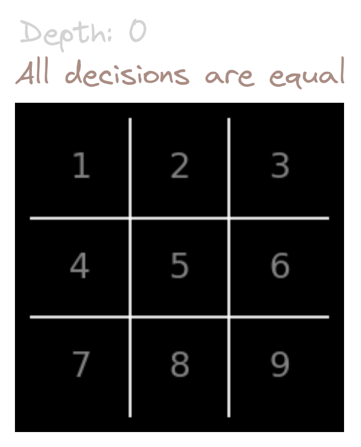
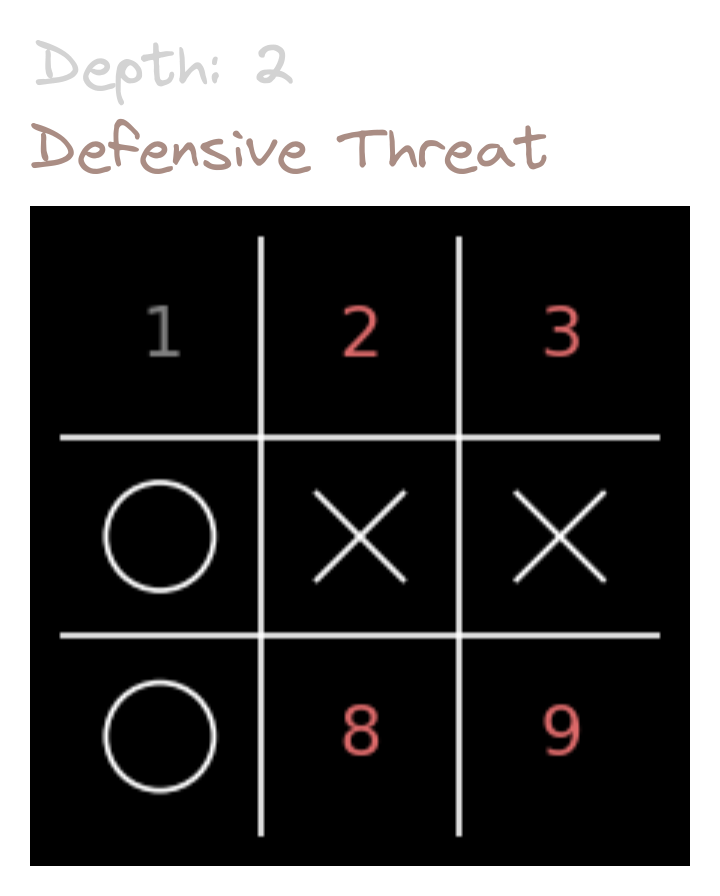
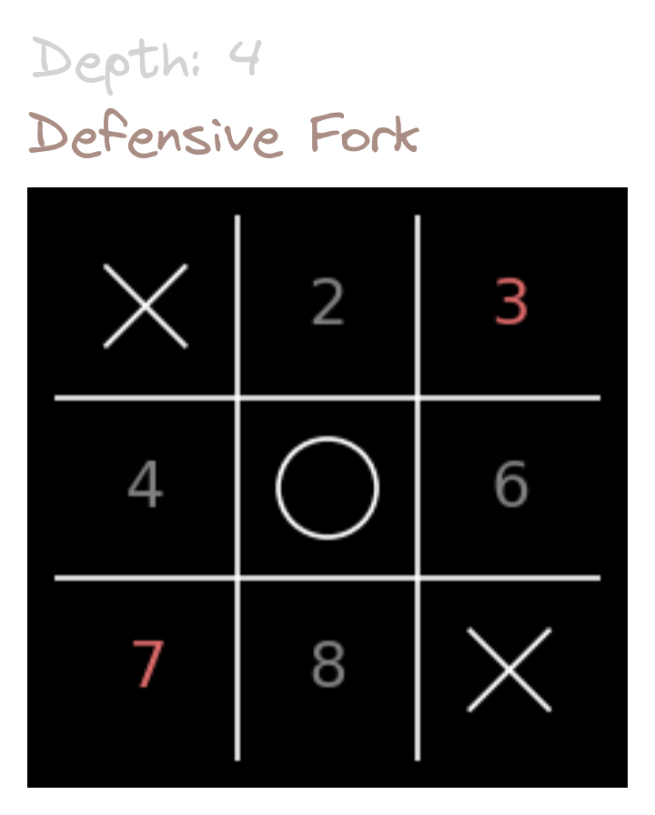

#### Why a tic-tac-toe dataset? Isn’t it a solved game?

The goal of this dataset was to test the chain-of-thought reasoning of Large Language Models (LLMs) using the game of tic-tac-toe, as elaborated [here](https://www.cloudwalk.io/ai/consciousness-reasoning-and-llms-playing-tic-tac-toe).
Although simple for humans, tic-tac-toe is challenging for LLMs.

Ideally, we want to identify the most challenging boards to maximize our ability to assess the reasoning skills of players while minimizing the number of boards needed for evaluation.
What follows is not only the methodology to build this dataset, but a study on the game of tic-tac-toe itself.

## Filtering

The tic-tac-toe board has 3^9 (= 19683) possible board configurations. Of those, only 5478 are reachable under the rules of the game.

  

We can further filter this down to:

- Symmetry Groups: Tic-tac-toe boards can be grouped by rotation and mirroring. These symmetry groups can contain 1, 2, 4 or 8 boards. By picking one board of each group, we reduce the set to 765 unique boards.
- Decidable Boards: We only include boards where a decision must be made, excluding terminal states and boards where all moves lead to the same outcome. This leaves 431 unique decidable boards.

## Ranking

We then rank the 431 boards based on difficulty, which requires knowing the score for each possible move in a given board state. To calculate this, we use the minimax algorithm, which determines the outcome if both players play optimally from a given starting board. Optimal play is defined by two key rules:

- 1st. Choose the move with the highest score.
- 2nd. If there are multiple moves with the same score, prefer the move that leads to the closest win or the latest possible loss/draw.

While classical minimax only considers the first rule, we include the second to track for move depth.

With the scores and depths for each move, we can rank the 431 boards based on "choice complexity" and "depth complexity."

### Choice Complexity

This is the chance of making a mistake when choosing randomly.

  

### Depth Complexity

This is how deep into the game the conclusion lies when following optimal moves.

  

Boards in tic-tac-toe can actually be grouped into 6 meaningful categories according to depth.

- Stance:
  - Offensive (1, 3, 5): creating an attack.
  - Defensive (2, 4, 6): defending against an attack.
- Pattern:
  - Threats (1, 2): A line with two identical marks and one empty cell.
  - Forks (3, 4): Two simultaneous threats.
  - Threat-Forks (5, 6): Create a threat that leads to a fork when defended.

No board has a depth beyond 6.

### Examples

  
  &nbsp;&nbsp;&nbsp;&nbsp;
  

  
  &nbsp;&nbsp;&nbsp;&nbsp;
  

  
  &nbsp;&nbsp;&nbsp;&nbsp;
  

  
  &nbsp;&nbsp;&nbsp;&nbsp;
  

## Usage

All of these ideas are already processed into the `dataset.json`.
You can interact directly with it (as in `manipulate_dataset.ipynb`), or use the sample of top 50 most difficult boards at `dataset_top50.json`.
For the top 50, we also made measured a reference point for human performance (on 3 people), and got the average of 42/50.
